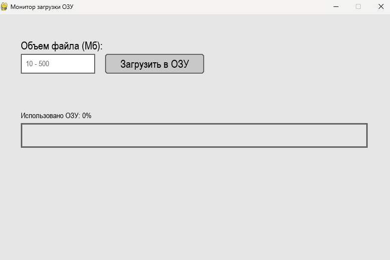
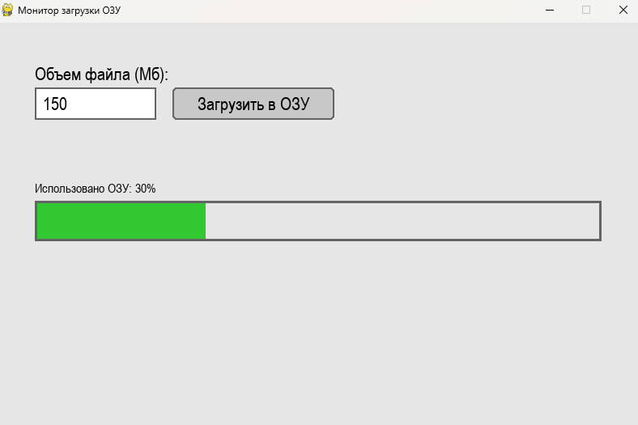
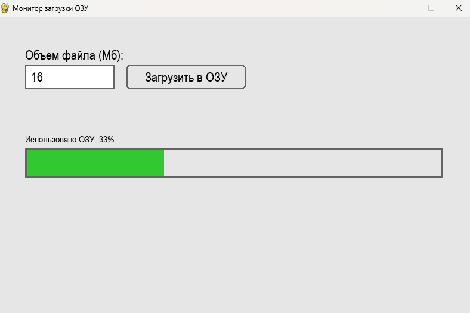
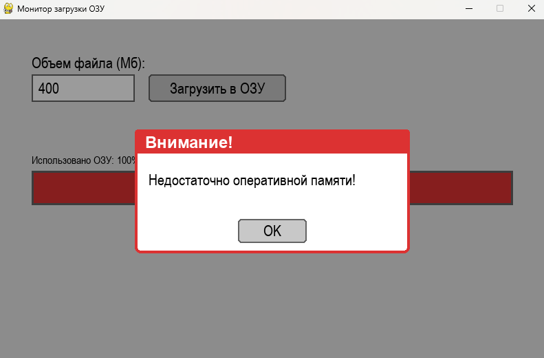

# RAM Loader App — Монитор загрузки ОЗУ на Pygame

Приложение для визуализации и симуляции процесса выделения оперативной памяти под файлы различного объема с системой предотвращения переполнения буфера.

## Возможности

- **Интерактивный GUI средствами Pygame:** Полноценный графический интерфейс пользователя (кастомные текстовые поля ввода `Entry` и кнопки `Button` с эффектом изменения цвета при наведении курсора).
- **Валидация вводимых данных:** Автоматическая проверка корректности ввода объема файла в диапазоне от 10 до 500 Мб.
- **Динамическая плавная анимация:** Скорость заполнения шкалы памяти ОЗУ в реальном времени зависит от размера файла (больше файл — дольше длится загрузка).
- **Система предупреждения (MessageBox):** Кастомное модальное окно, блокирующее интерфейс и сигнализирующее о нехватке памяти при достижении уровня 100%.

## Установка зависимостей

Проект использует объектно-ориентированный подход (ООП) и написан на чистом Python с использованием графической библиотеки Pygame.

```bash
python3 -m venv .venv
source .venv/bin/activate
pip install pygame

```

## Запуск

Для запуска финальной комплексной версии программы выполните команду:

```bash
python3 main.py

```

## Использование

1. Нажмите на текстовое поле **Объем файла (Мб)** и введите числовое значение в диапазоне от 10 до 500.
2. Кликните на кнопку **Загрузить в ОЗУ**.
3. Наблюдайте за плавным заполнением шкалы памяти слева направо (индикатор отображает текущий процент использования ресурсов).
4. При повторных загрузках, если суммарный объем превысит лимит и шкала заполнится до 100%, на экране появится всплывающее окно **«Недостаточно оперативной памяти!»**.
5. Нажмите кнопку **OK** на окне предупреждения, чтобы сбросить монитор и начать заново.

## Скриншоты

Ниже приведены примеры работы приложения на различных этапах его разработки.

### «Интерфейс ввода и валидация»


### «Структура шкалы MemoryBar» 

### «Процесс плавной загрузки» 

### «Предупреждение о переполнении ОЗУ» 
